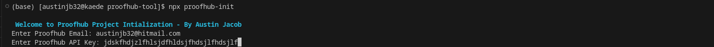
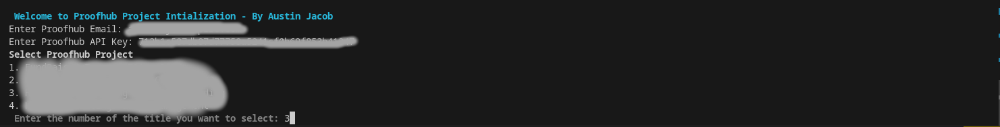
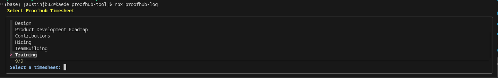
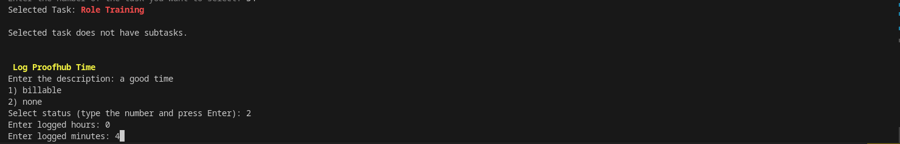

---

# proofhub-tool

A set of command-line tools for Proofhub project initialization and time logging.

## Table of Contents

- [Installation](#installation)
- [Usage](#usage)
  - [Proofhub Project Initialization](#proofhub-project-initialization)
  - [Proofhub Time Logging](#proofhub-time-logging)
- [Requirements](#requirements)
- [Notes](#notes)
- [Contributing](#contributing)
- [License](#license)

## Installation

Before using `proofhub-tool`, make sure you have the required dependencies installed on your system:

- `jq` (JSON processor): [jq Installation Guide](https://stedolan.github.io/jq/download/)
- `curl`: [curl Download Page](https://curl.haxx.se/download.html)

Install the package globally using npm:

```bash
npm install -g proofhub-tool
```

## Usage

### Proofhub Project Initialization

The `proofhub-init` command initializes a Proofhub project by creating a `proofhub.json` configuration file.

```bash
npx proofhub-init
```

Follow the prompts to enter your Proofhub email, API key, and select a project.

### Proofhub Time Logging

The `proofhub-log` command facilitates time logging in Proofhub by interacting with the Proofhub API.

```bash
npx proofhub-log
```

Follow the prompts to select a Proofhub Timesheet, Todolist, Task, and Subtask, and log time for the selected entry.

### Proofhub Time Logging- Setup

First step, is to intialize the proofhub-tool inside project root, so please run  `proofhub-init` first:


Second step, Enter the details such as Proofhub Email and Proofhub API Key, then the project assigned to you will be displayed & upon completion and `proofhub.json` file will be created:


Third step, to log time in Proofhub, please run `proofhub-log`:


Fourth step, Select Timesheet, Todolist, Tasks, Subtasks(if there) & Enter description, status, hours, and mins to log time in proofhub:


Note:
 - In Todolist, Tasks, Subtasks & status you have enter the no. of the title that needs to be selected.

## Requirements

- Bash
- jq (JSON processor)
- `curl`
- Proofhub account
- Proofhub API key

## Notes

- Ensure that `jq` is installed on your system.
- Provide your Proofhub email and API key when prompted.
- Select the Proofhub project by entering the corresponding number.
- The script will create a `proofhub.json` file with the selected project's information.

## Contributing

Contributions are welcome! Feel free to open issues or submit pull requests on the [GitHub repository](https://github.com/austinjb32/proofhub-tool).

## License

This project is licensed under the MIT License - see the [LICENSE](LICENSE) file for details.

---
